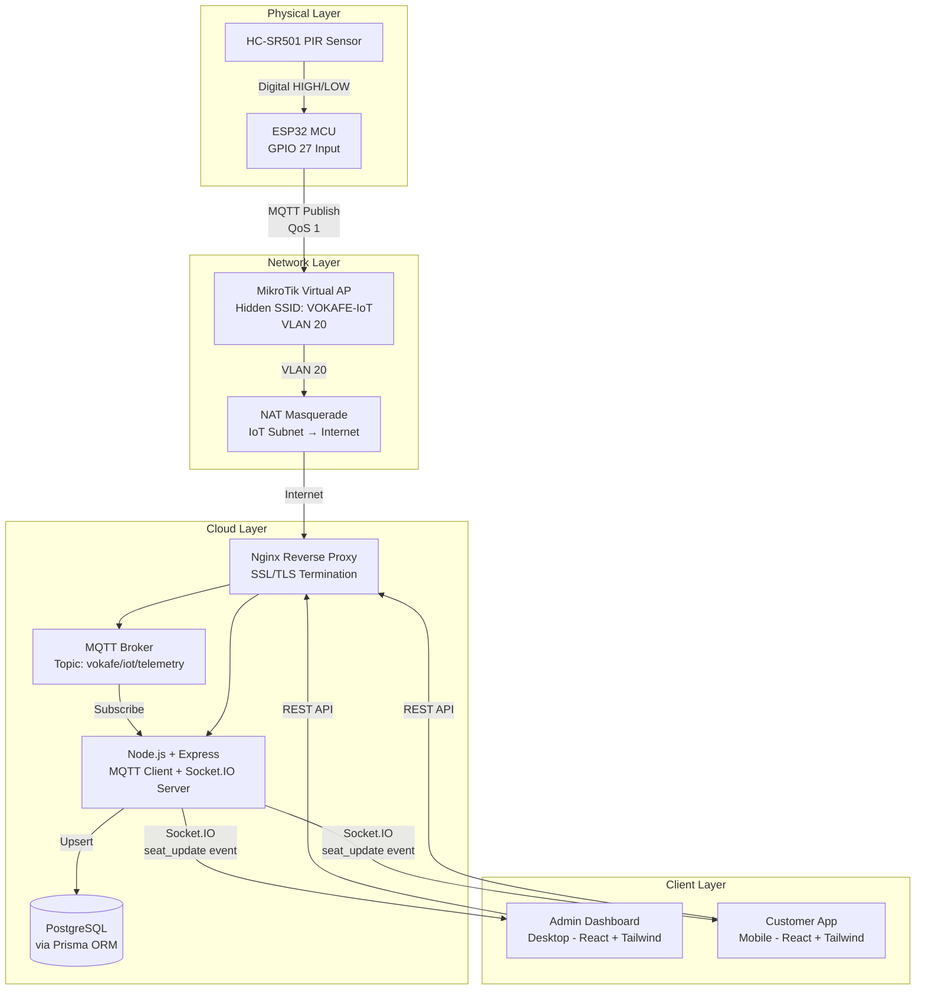
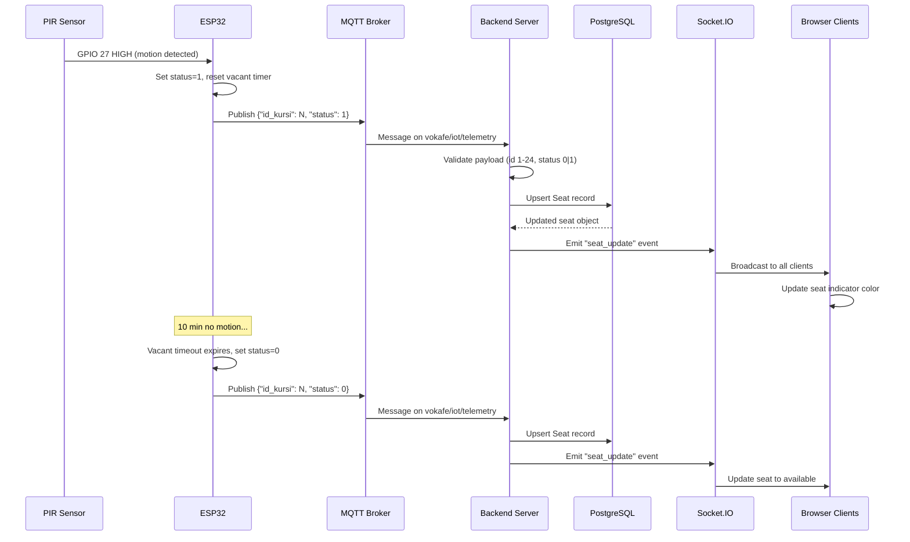
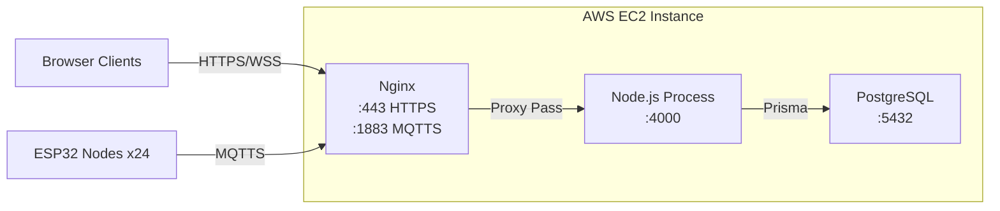
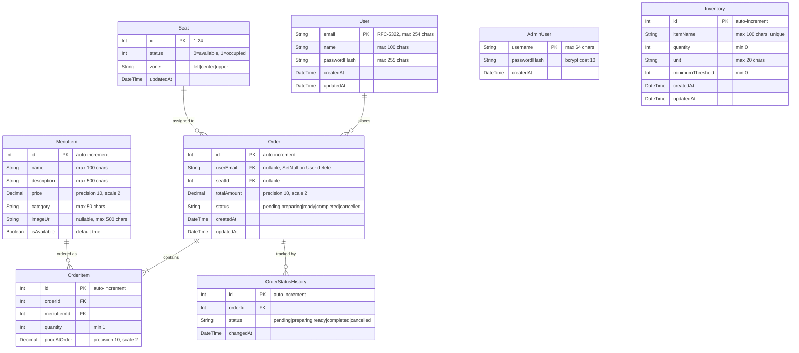

# Design Document: VOKA-SEAT System

## Overview

VOKA-SEAT is an end-to-end IoT-based real-time seat occupancy monitoring system for VOKAFE coffeeshop. The system spans four layers: embedded firmware (ESP32 + PIR sensors), network infrastructure (MikroTik VLAN isolation), cloud backend (Node.js/Express + PostgreSQL), and web frontends (React Admin Dashboard + Mobile Customer App).

A key design decision is the **dual design language** that splits the visual identity of the two frontends: the Admin Dashboard uses the existing flat utility palette (`Admin_Flat_Palette`) tuned for high-density desktop monitoring, while the Customer App uses a Material Design 3 token-based system (`Customer_MD3_Tokens`) with Lexend + Inter typography and Material Symbols Outlined icons for a warm, mobile-first feel. Both frontends share the same Floor Plan Reference layout but render seats with palette-specific color mappings.

A second key design decision is the **asymmetric authentication model**. Customer authentication is **optional**: unauthenticated visitors can browse the Menu, Tables, Cart, and Checkout flows and place a Guest_Order without creating an account; only the Order History and Order Detail views require a customer JWT. Admin access is **gated** behind a separate endpoint (`POST /api/auth/admin/login`) that authenticates against a single env-seeded Admin_Account stored in its own AdminUser table or in-memory map; admin JWTs carry `role: 'admin'` while customer JWTs carry `role: 'customer'`, and the two flows never cross over. Customer identity is keyed by **email** (RFC 5322, max 254 chars) instead of NIM so the schema is portable beyond the campus context.

The architecture follows an event-driven pipeline:
1. PIR sensors detect thermal presence at each of 24 seats
2. ESP32 firmware applies a 10-minute vacant timeout algorithm and publishes state changes via MQTT
3. The backend ingests MQTT telemetry, validates payloads, persists to PostgreSQL, and broadcasts via Socket.IO
4. Connected browser clients render real-time seat status updates without page reloads

### Key Design Decisions

| Decision | Rationale |
|----------|-----------|
| PIR-only detection with 10-min timeout | Prevents false negatives from stationary occupants (reading/typing); HC-SR501 is cost-effective and non-invasive |
| MQTT QoS 1 (at-least-once) | Balances reliability with simplicity; backend handles idempotent upserts |
| Hidden SSID on VLAN 20 | Isolates IoT traffic from campus network; reduces attack surface |
| Socket.IO over raw WebSocket | Provides automatic reconnection, room support, and fallback transports |
| Prisma ORM | Type-safe database access with migration support; aligns with TypeScript backend |
| Single PostgreSQL database | Sufficient for 24-seat scale; avoids distributed system complexity |
| React + Tailwind CSS frontend | Component-based UI with utility-first styling; matches existing codebase |
| Dual design language | Admin uses flat utility palette for high-density desktop monitoring; Customer uses MD3 tokens with Lexend/Inter for warm mobile feel |
| Customer mint-green available seats | Higher color contrast (#6cf8bb) than gray for at-a-glance scanning by customers; Admin retains gray (#F3F4F6) for neutral monitoring |
| Indoor/Outdoor toggle (Outdoor placeholder) | Forward-compatible UI affordance for future expansion; Outdoor displays a "Coming Soon" placeholder in the MVP |
| QR FAB as forward-compatible UI | UI affordance for future QR check-in flow; backend out of MVP scope; tap shows a "Coming soon" toast |
| Optional customer auth | Lower friction for first-time visitors who just want to browse + checkout; persistent identity is opt-in via Profile tab |
| Email PK over NIM | Email is universally available, no campus dependency, simpler RFC-5322 validation, and supports any guest who later wants to register |
| Separate admin endpoint with env-seeded credentials | Avoids cross-contamination between customer and admin auth flows; supports a single privileged operator without provisioning UI |
| Guest orders preserved on user deletion | `ON DELETE SET NULL` on `userEmail` keeps the order trail for the business but releases the personal identifier |

## Architecture

### System Architecture Diagram



### Data Flow Sequence



### Deployment Architecture



## Components and Interfaces

### 1. Firmware Component (ESP32 Sensor Node)

**Responsibility:** Detect seat occupancy via PIR sensor, apply vacant timeout logic, transmit state changes via MQTT.

| Interface | Type | Description |
|-----------|------|-------------|
| `PIR_PIN` (GPIO 27) | Hardware Input | Digital read of PIR sensor output |
| `MQTT Publish` | Network Output | JSON payload to `vokafe/iot/telemetry` topic |
| `WiFi Connection` | Network | Hidden SSID "VOKAFE-IoT" on VLAN 20 |

**Key Parameters:**
- Polling interval: 100ms
- Vacant timeout: 600,000ms (10 minutes)
- Debounce threshold: 200ms HIGH for occupied detection
- Sensor fault detection: 3,600,000ms (60 minutes) unchanged state
- MQTT retry: 3 attempts, 2-second interval
- WiFi reconnect interval: 5 seconds

### 2. Backend Server Component

**Responsibility:** Ingest MQTT telemetry, validate payloads, persist state, serve REST API, broadcast WebSocket events.

#### Sub-components:

| Sub-component | Responsibility |
|---------------|---------------|
| MQTT Client | Subscribe to telemetry topic, receive messages |
| Telemetry Validator | Parse JSON, validate id_kursi (1-24) and status (0\|1) |
| Seat Service | Upsert seat records via Prisma ORM |
| WebSocket Broadcaster | Emit seat_update events to connected clients |
| REST API Router | Serve endpoints for seats, orders, menu, inventory, users |
| Customer Auth Middleware | Validates JWT carrying `role: 'customer'`. Required only on customer-scoped routes that read user-specific data (Order History, Order Detail). Order creation accepts requests with or without this JWT. |
| Admin Auth Middleware | Validates JWT carrying `role: 'admin'`. Required on all admin-only routes (orders pending/assign/status, inventory, analytics). Returns 401 if no/invalid JWT, 403 if the JWT is valid but lacks `role: 'admin'`. |
| Admin Account Seeder | On boot, reads `ADMIN_USERNAME` and `ADMIN_PASSWORD` from environment variables, hashes the password with bcrypt (cost ≥ 10), and persists the credential to the AdminUser store (Prisma table or in-memory map). Idempotent: existing entry with the same username is updated rather than duplicated. |

#### REST API Endpoints:

| Method | Path | Auth | Description |
|--------|------|------|-------------|
| GET | `/api/health` | No | Health check |
| GET | `/api/seats` | No | Get all 24 seat statuses |
| GET | `/api/seats/:id` | No | Get single seat status |
| POST | `/api/auth/login` | No | Customer login. Body: `{ email, password }`. Returns JWT with `role=customer`. |
| POST | `/api/auth/admin/login` | No | Admin login. Body: `{ username, password }`. Returns JWT with `role=admin`. Only matches the seeded Admin_Account; customer-table credentials submitted here are rejected with 401. |
| POST | `/api/auth/register` | No | Customer registration. Body: `{ email, name, password }`. Returns JWT with `role=customer`. |
| GET | `/api/menu` | No | Get menu catalog |
| GET | `/api/menu?category=:cat` | No | Filter menu by category |
| POST | `/api/orders` | Optional JWT | Create new order. JWT optional: if present and `role=customer`, the order is persisted with `userEmail` set to the JWT's email; if absent, invalid, or expired, the order is persisted as a Guest_Order with `userEmail = NULL`. The handler MUST NOT reject the request solely for missing or invalid auth. |
| PATCH | `/api/orders/:id/claim` | Customer JWT | Retroactively associate a Guest_Order with the authenticated customer. Sets `userEmail` to the JWT's email. Only succeeds when the order's `userEmail` is currently NULL. (TODO: choose claim-validation strategy — either a signed claim token returned by POST `/api/orders` and presented here, or a same-session order-id grace window of X minutes. Pick one before implementation.) |
| GET | `/api/orders/history` | Customer JWT | Get the authenticated customer's order history (paginated). |
| GET | `/api/orders/:id` | Customer JWT | Get single order detail with items, status_history, and assigned seat. The handler MUST verify the order's `userEmail` matches the JWT email (or returns 404 if the order is a Guest_Order belonging to no one). |
| GET | `/api/orders/pending` | Admin JWT (role=admin) | Get pending orders queue |
| PATCH | `/api/orders/:id/assign-seat` | Admin JWT (role=admin) | Assign seat to order |
| PATCH | `/api/orders/:id/status` | Admin JWT (role=admin) | Update order status |
| GET | `/api/inventory` | Admin JWT (role=admin) | Get inventory list |
| PATCH | `/api/inventory/:id` | Admin JWT (role=admin) | Update inventory quantity |
| GET | `/api/analytics/sales` | Admin JWT (role=admin) | Get sales analytics |
| GET | `/api/analytics/occupancy` | Admin JWT (role=admin) | Get seat occupancy analytics |

#### Socket.IO Events:

| Event | Direction | Payload | Description |
|-------|-----------|---------|-------------|
| `seat_update` | Server → Client | `{ id: number, status: number, updatedAt: string }` | Single seat status change |
| `all_seats` | Server → Client | `Array<{ id, status, zone, updatedAt }>` | Full state on connection |
| `error` | Server → Client | `{ message: string }` | Error notification |
| `connection` | Client → Server | — | Client connects |
| `disconnect` | Client → Server | — | Client disconnects |

### 3. Admin Dashboard Component

**Responsibility:** Desktop web interface for real-time seat monitoring, order management, inventory tracking, and analytics.

**Design language:** The Admin Dashboard retains the existing `Admin_Flat_Palette` (backgrounds #FFFFFF and #F3F4F6, text #1E293B / #475569, occupied seat #D81B60 with white text, available seat #F3F4F6 with #E5E7EB border) and is unaffected by the Customer App MD3 redesign. Admin and Customer share only the Floor Plan Reference spatial layout.

| View | Key Features |
|------|-------------|
| Tablespace | Floor plan with 24 seat indicators across 3 zones; real-time color updates |
| Order Queue | Pending order cards with urgency tiers (URGENT/WAITING/NEW); assign-table flow |
| Inventory | Stock table with threshold alerts (amber/red indicators) |
| Analytics | Sales totals, peak hours, seat efficiency; CSV export |
| Sidebar | Fixed 240px left navigation; VOKAFE brand logo at top |

### 4. Customer App Component

**Responsibility:** Mobile web interface for menu browsing, seat availability viewing, ordering, payment, and account management.

**Design language:** The Customer App uses the `Customer_MD3_Tokens` Material Design 3 system, distinct from the Admin Dashboard's flat palette. The Floor Plan Reference spatial layout is shared with the Admin Dashboard (same Zona Atas tribune 4-row × 3-column-group, Zona Kiri vertical strip, Zona Tengah & Kanan 2×3 Meja Beton with sensor positions on top/bottom edges); only the seat color mapping differs.

#### Design System

| Token group | Values |
|-------------|--------|
| Primary palette | `primary` #b80035, `primary-container` #e11d48, `on-primary` #ffffff, `primary-fixed` #ffdada, `surface-tint` #be0037 |
| Secondary palette | `secondary` #006c49, `secondary-container` #6cf8bb (used for available seats), `on-secondary-container` #00714d, `secondary-fixed` #6ffbbe |
| Tertiary palette | `tertiary` #006855, `tertiary-container` #00836c, `on-tertiary-container` #eefff7 |
| Surface palette | `surface` / `background` / `surface-bright` #fbf8fc, `surface-container-lowest` #ffffff, `surface-container-low` #f6f2f7, `surface-container` #f0edf1, `surface-container-high` #eae7eb, `surface-container-highest` #e4e1e6, `surface-variant` #e4e1e6 |
| Text & outline | `on-surface` #1b1b1e, `on-surface-variant` #5c3f40, `outline` #906f70, `outline-variant` #e5bdbe |
| Error | `error` #ba1a1a, `error-container` #ffdad6, `on-error-container` #93000a |
| Typography — headlines | Lexend: `headline-md` 24/32 600, `headline-sm` 20/28 500, `headline-lg-mobile` 28/36 600, `display-lg` 32/40 600 |
| Typography — body & label | Inter: `body-md` 16/24 400, `body-sm` 14/20 400, `label-md` 14/20 600, `label-sm` 12/16 500 |
| Border radius | DEFAULT 0.25rem, `lg` 0.5rem, `xl` 0.75rem, `full` 9999px |
| Spacing scale | xs 4px, sm 8px, md 16px, lg 24px, xl 32px, margin-mobile 16px, margin-tablet 24px |
| Icon font | Material Symbols Outlined (variation settings: FILL 0/1, wght 400, GRAD 0, opsz 24) |
| Primary button | rounded-xl, `bg-primary` background, `text-on-primary`, glow shadow `0 4px 12px rgba(225, 29, 72, 0.2)` |
| Tactile feedback | `active:scale-95` (or `active:scale-[0.98]` on cards) on all touchable elements |

#### Authentication state

The Customer App models customer authentication as **optional**, never as a gate. Three states co-exist and any tab is reachable from any of them:

1. **Guest** — No JWT in `localStorage`. All four bottom-nav tabs (Menu, Tables, Cart, Profile) are accessible. The Profile tab renders a guest-state CTA ("Sign In or Create Account") instead of name/email/order-history. The Order History entry is hidden. Outgoing requests do not include an Authorization header.
2. **Authenticated** — A customer JWT is present in `localStorage[vokafe_customer_jwt]`. The Profile tab shows the customer's name and email, an "Order History" entry, and a "Logout" button. Every outgoing customer-scoped request attaches `Authorization: Bearer <jwt>`.
3. **Login / Register screens** — Reached only by explicit user action (tapping "Sign In or Create Account" from the guest Profile, OR tapping "Save Order to Account" on the Payment Success screen). They are screens, not gates: the customer can navigate back to Menu/Tables/Cart at any time without authenticating.

A 401 from `/api/orders/history` or `/api/orders/:id` (token expired or invalid) drops the app back to Guest state by clearing `vokafe_customer_jwt` and re-rendering the Profile tab in its guest form; it does not lock the rest of the app.

#### Tabs and persistent chrome

The persistent `Customer_Top_App_Bar` (64px tall, surface background, VOKAFE logo on the left, Material Symbols Outlined search icon on the right) and the fixed bottom navigation are rendered **regardless of authentication state**, so the app feels like a normal app from first launch and the customer never hits an auth wall before reaching the menu.

| Tab | Key Features |
|-----|-------------|
| Menu | Category-filtered catalog; quick add-to-cart; item images; `Cart_Summary_Bar` shown above bottom nav when cart has ≥1 item |
| Tables | Full 24-seat floor plan in scrollable/pannable container per Floor Plan Reference; Indoor/Outdoor segmented toggle; legend; QR FAB; real-time updates |
| Cart | Quantity adjustment; total recalculation; checkout flow leading to Payment Success |
| Profile | **Guest state** shows the VOKAFE brand logo and a single "Sign In or Create Account" CTA, with no name, email, or order history. **Authenticated state** shows the customer's name, email, an "Order History" entry, and a "Logout" button. Logout clears `vokafe_customer_jwt` and returns the tab to its guest state. |

#### Additional views (outside the tab bar)

| View | Purpose |
|------|---------|
| Login screen | Centered white card on `surface` background, VOKAFE logo, leading `mail` and `lock` Material Symbols icons inside inputs, primary "Login" button with glow shadow, footer link "Don't have an account? Sign Up". The email input enforces RFC-5322 format client-side via `/^[^\s@]+@[^\s@]+\.[^\s@]+$/`. Reached only from explicit user action ("Sign In or Create Account" CTA on the guest Profile tab, or "Save Order to Account" on the Payment Success screen). Never an auth gate that blocks app entry. |
| Register screen | Centered white card with VOKAFE logo, fields for email (RFC-5322), full name, password, password confirmation; submit button styled as primary; footer link to switch back to Login. On 409 Conflict from POST `/api/auth/register`, the email field shows an inline "Email already registered" error. |
| Payment Success screen | Full-screen confirmation reached after successful payment. Displays order number, summary of items ordered, total paid (IDR), and two primary actions: "View Order Status" (navigates to Order Detail) and "Back to Menu" (returns to Menu tab). When the order was placed in **guest mode** (no JWT was sent on POST `/api/orders`), a secondary CTA "Save Order to Account" appears below the primary actions; tapping it routes to the Login screen, and on successful login or registration the app calls PATCH `/api/orders/:id/claim` to retroactively set `userEmail` on the just-placed order. The CTA is hidden when the customer was already authenticated at checkout. |
| Order History list | Reached from Profile tab. Paginated (20 per page) list of past orders, each row shows order date, item summary, total, and a color-coded `Order_Status_Pill`. Tap navigates to Order Detail |
| Order Detail view | Shows order number, line items, total, assigned seat (or "No seat assigned" placeholder when seatId is null), and a status timeline rendered from `OrderStatusHistory` records |

#### Tables view enhancements

The Tables view reuses the Floor Plan Reference layout but adds the following customer-only chrome:

- **Indoor/Outdoor segmented toggle** at the top of the view. Indoor is the default and renders the full 24-seat floor plan. Outdoor renders a "Coming Soon" placeholder card.
- **Legend** below the toggle: a `secondary-container` (#6cf8bb) swatch labelled "Available" and a `primary` (#b80035) swatch labelled "Occupied".
- **`ScanQrFab`** floating action button anchored bottom-right above the bottom nav, 56×56px, `bg-primary` with `qr_code_scanner` Material Symbol. Tap triggers a "Coming soon" toast; no backend call is made in MVP.

#### Cart Summary Bar

A sticky bar that floats above the bottom navigation, visible **only on the Menu tab when the cart has ≥1 item**, regardless of authentication state. Contents: item count (e.g. "2 items") on the left, formatted IDR total below it, and a primary-styled "View Cart" button on the right that navigates to the Cart tab. After checkout, the Payment Success screen — not this bar — surfaces the optional "Save Order to Account" CTA for guest checkouts.

#### Order Status Pill color mapping

| Status | Background | Text |
|--------|-----------|------|
| pending | amber (`#FEF3C7` background, `#92400E` text) | dark amber |
| preparing | `primary` (#b80035) | `on-primary` (#ffffff) |
| ready | `tertiary` (#006855) | `on-tertiary` (#ffffff) |
| completed | `secondary-container` (#6cf8bb) | `on-secondary-container` (#00714d) |
| cancelled | `error-container` (#ffdad6) | `on-error-container` (#93000a) |

### 5. Network Infrastructure Component

**Responsibility:** Isolate IoT traffic, route telemetry to cloud.

| Element | Configuration |
|---------|--------------|
| VLAN 10 | Campus network (IPB-ACCESS), Layer 2 bridge |
| VLAN 20 | IoT network (VOKAFE-IoT), hidden SSID, WPA2+ |
| NAT Masquerade | IoT subnet → public internet |
| Firewall | No inter-VLAN routing between VLAN 10 and VLAN 20 |
| MikroTik CLI | All configuration via RouterOS CLI only |

### 6. Customer App Component Architecture

The Customer App lives in its own subtree under `frontend/src/customer/` to keep the MD3 design system isolated from the Admin Dashboard's flat-palette components. The structure is:

```
frontend/src/customer/
├── CustomerApp.tsx          # Root layout with optional-auth state + persistent chrome + bottom nav
├── auth/
│   ├── LoginScreen.tsx      # Reached only by user action; not an entry gate
│   ├── RegisterScreen.tsx   # Reached only by user action; not an entry gate
│   └── useAuth.ts           # Reads/writes vokafe_customer_jwt; exposes login/register/logout/isAuthenticated
├── views/
│   ├── MenuView.tsx
│   ├── TablesView.tsx
│   ├── CartView.tsx
│   ├── CheckoutView.tsx
│   ├── PaymentSuccessView.tsx     # Renders "Save Order to Account" CTA when the order was placed in guest mode
│   ├── ProfileView.tsx            # Renders guest CTA or authenticated profile based on useAuth state
│   ├── OrderHistoryView.tsx       # Reachable only when authenticated
│   └── OrderDetailView.tsx        # Reachable only when authenticated
├── components/
│   ├── TopAppBar.tsx              # Rendered regardless of auth state
│   ├── BottomNav.tsx              # Rendered regardless of auth state
│   ├── CartSummaryBar.tsx
│   ├── OrderStatusPill.tsx
│   ├── ScanQrFab.tsx
│   ├── IndoorOutdoorToggle.tsx
│   └── SeatLegend.tsx
├── theme/
│   └── tokens.ts            # Customer_MD3_Tokens
└── hooks/
    ├── useCart.ts
    └── useOrderHistory.ts
```

The existing files (`LoginScreen.tsx`, `RegisterScreen.tsx`, `useAuth.ts`) keep their current paths; only their behavior changes (email-keyed credentials, no-gate semantics, retroactive-claim helper). The Admin app's login screen lives in a separate subtree (`frontend/src/admin/auth/`, see Section 7) so the Customer subtree never imports it.

**Tailwind configuration:** The Customer App uses an extended Tailwind theme scoped under `md3-tokens` that defines the full Customer_MD3_Tokens color set, the Lexend + Inter font families (with size and weight presets for `display-lg`, `headline-md`, `headline-sm`, `headline-lg-mobile`, `body-md`, `body-sm`, `label-md`, `label-sm`), the border-radius scale (DEFAULT 0.25rem, `lg` 0.5rem, `xl` 0.75rem, `full` 9999px), the spacing scale (xs/sm/md/lg/xl plus margin-mobile/margin-tablet), and the Material Symbols Outlined icon font loaded via Google Fonts. The Admin Dashboard continues to use the existing utility palette and is not migrated to this extended theme.

### 7. Admin App — Auth Gate (NEW)

The Admin_Dashboard wraps `App.tsx` in an admin auth gate that lives in its own subtree under `frontend/src/admin/`, separate from the Customer App. Files:

```
frontend/src/admin/
├── auth/
│   ├── AdminLoginScreen.tsx   # Username + password centered card, primary submit, generic "Invalid credentials" inline error
│   └── useAdminAuth.ts        # Reads/writes vokafe_admin_jwt; exposes login/logout/isAuthenticated
└── AdminAppShell.tsx          # Renders <AdminLoginScreen /> when no JWT, else the existing <App />
```

**Behavior:**
- On mount, `useAdminAuth()` reads `localStorage[vokafe_admin_jwt]`. If absent, `AdminAppShell` renders `<AdminLoginScreen />` and nothing else; the existing `<App />` does not mount.
- `AdminLoginScreen` submits `{ username, password }` to `POST /api/auth/admin/login`. On HTTP 200, the returned JWT is persisted via `useAdminAuth().login(jwt)` and the shell re-renders into `<App />`. On HTTP 401, a generic "Invalid credentials" inline error is shown and the password field is cleared; the screen never reveals which field is wrong.
- The wrapped `<App />` and all its admin-scoped fetch calls attach `Authorization: Bearer <jwt>` from `vokafe_admin_jwt` to every request. A shared `adminFetch` helper centralizes this so individual views don't need to know about the token.
- Any 401 or 403 response from an admin API call calls `useAdminAuth().logout()` (which clears `vokafe_admin_jwt`); the shell re-renders to the login screen within 1 second per Requirement 21.5.
- The "Logout" button is added to the existing fixed `Sidebar`, calls `useAdminAuth().logout()`, and triggers the same gate re-render.
- Unlike the Customer App, the admin gate **is** an entry gate: no admin view is reachable without a valid `role: 'admin'` JWT. The Customer App is unaffected by this gate; the two apps remain independent React entry points.

The `AdminLoginScreen.tsx` file is intentionally **not** placed under `frontend/src/customer/auth/` — admin and customer auth flows live in disjoint subtrees so they cannot accidentally share state, components, or storage keys.

## Data Models

### Entity Relationship Diagram



> **Note:** `AdminUser` is a standalone entity with no relations to `Order`, `User`, or any other model. It is used solely by `POST /api/auth/admin/login` to authenticate the seeded Admin_Account. Customer `User` records and `AdminUser` records live in disjoint stores; they are never joined or queried together.

### Prisma Schema (Target)

```prisma
generator client {
  provider = "prisma-client-js"
}

datasource db {
  provider = "postgresql"
}

model User {
  email        String   @id @db.VarChar(254)
  name         String   @db.VarChar(100)
  passwordHash String   @db.VarChar(255)
  createdAt    DateTime @default(now())
  updatedAt    DateTime @updatedAt
  orders       Order[]
}

model AdminUser {
  username     String   @id @db.VarChar(64)
  passwordHash String   @db.VarChar(255)
  createdAt    DateTime @default(now())
}

model Seat {
  id        Int      @id // 1-24
  status    Int      @default(0) // 0=available, 1=occupied
  zone      String   @db.VarChar(10) // "left", "center", "upper"
  updatedAt DateTime @updatedAt
  orders    Order[]
}

model Order {
  id          Int                  @id @default(autoincrement())
  userEmail   String?              @db.VarChar(254)
  seatId      Int?
  totalAmount Decimal              @db.Decimal(10, 2)
  status      String               @default("pending") @db.VarChar(20)
  createdAt   DateTime             @default(now())
  updatedAt   DateTime             @updatedAt
  user        User?                @relation(fields: [userEmail], references: [email], onDelete: SetNull)
  seat        Seat?                @relation(fields: [seatId], references: [id], onDelete: SetNull)
  items       OrderItem[]
  statusHistory OrderStatusHistory[]
}

model OrderItem {
  id           Int      @id @default(autoincrement())
  orderId      Int
  menuItemId   Int
  quantity     Int      // min 1
  priceAtOrder Decimal  @db.Decimal(10, 2)
  order        Order    @relation(fields: [orderId], references: [id], onDelete: Cascade)
  menuItem     MenuItem @relation(fields: [menuItemId], references: [id])
}

model OrderStatusHistory {
  id        Int      @id @default(autoincrement())
  orderId   Int
  status    String   @db.VarChar(20)
  changedAt DateTime @default(now())
  order     Order    @relation(fields: [orderId], references: [id], onDelete: Cascade)
}

model MenuItem {
  id          Int         @id @default(autoincrement())
  name        String      @db.VarChar(100)
  description String      @db.VarChar(500)
  price       Decimal     @db.Decimal(10, 2)
  category    String      @db.VarChar(50)
  imageUrl    String?     @db.VarChar(500)
  isAvailable Boolean     @default(true)
  orderItems  OrderItem[]
}

model Inventory {
  id               Int      @id @default(autoincrement())
  itemName         String   @unique @db.VarChar(100)
  quantity         Int      @default(0)
  unit             String   @db.VarChar(20)
  minimumThreshold Int      @default(0)
  createdAt        DateTime @default(now())
  updatedAt        DateTime @updatedAt
}
```

### Telemetry Payload Schema

```typescript
interface TelemetryPayload {
  id_kursi: number; // Integer 1-24
  status: number;   // 0 (available) or 1 (occupied)
}
```

**Validation Rules:**
- Message body must be valid JSON
- Message body must not exceed 256 bytes
- Must contain exactly `id_kursi` (integer) and `status` (integer) fields
- `id_kursi` must be in range [1, 24]
- `status` must be exactly 0 or 1

### Seat Zone Mapping

| Zone | Label | Seat IDs | Description |
|------|-------|----------|-------------|
| `left` | Barista dan Kasir | 1, 2, 3, 4 | Vertical strip, single-seat tables |
| `upper` | Kursi Tangga | 11–24 | 4-row tribune, 3 column groups |
| `center` | Meja Beton | 5–10 | 6 rectangular tables, 2×3 grid |

## Correctness Properties

*A property is a characteristic or behavior that should hold true across all valid executions of a system—essentially, a formal statement about what the system should do. Properties serve as the bridge between human-readable specifications and machine-verifiable correctness guarantees.*


### Property 1: Firmware Vacant Timeout State Machine

*For any* sequence of PIR sensor readings on a seat node, if the sensor reads HIGH (motion detected) and then reads LOW continuously for exactly 600,000ms without interruption, the seat status SHALL transition from occupied (1) to available (0). If any HIGH reading occurs during the countdown, the timer SHALL reset and status SHALL remain occupied (1).

**Validates: Requirements 1.3, 1.4, 1.5**

### Property 2: Telemetry Payload Serialization Round-Trip

*For any* valid seat identifier (integer 1–24) and status value (0 or 1), serializing a TelemetryPayload to JSON and then parsing that JSON back SHALL produce an object with identical `id_kursi` and `status` values. The serialized payload SHALL not exceed 128 bytes.

**Validates: Requirements 2.3, 16.6**

### Property 3: Telemetry Payload Validation Completeness

*For any* incoming message on the MQTT telemetry topic, the validator SHALL accept the message if and only if: (a) the message is ≤ 256 bytes, (b) it is well-formed JSON, (c) it contains exactly the fields `id_kursi` (integer in [1,24]) and `status` (integer in {0,1}). All other messages SHALL be rejected without persisting.

**Validates: Requirements 4.1, 4.4, 4.5, 4.6, 16.1, 16.2, 16.3, 16.4, 16.5, 16.7**

### Property 4: WebSocket Broadcast Payload Invariant

*For any* seat_update event emitted by the WebSocket broadcaster, the event payload SHALL contain a seat identifier (integer in range 1–24) and a status value (exactly 0 or 1).

**Validates: Requirements 5.2**

### Property 5: Admin Dashboard Seat Indicator Color Mapping

*For any* seat with status = 1 (occupied) rendered in the **Admin Dashboard** SeatIndicator, the UI SHALL render the indicator with background color #D81B60 and white text. *For any* seat with status = 0 (available) rendered in the Admin Dashboard, the UI SHALL render the indicator with background color #F3F4F6 and a 1px solid #E5E7EB border. The Customer App seat color mapping is governed by Property 18.

**Validates: Requirements 6.3, 6.4**

### Property 6: Order Queue Sorting by Wait Time

*For any* set of pending orders with distinct creation timestamps, the order queue SHALL display them sorted by elapsed waiting time in descending order (longest-waiting first).

**Validates: Requirements 7.1**

### Property 7: Order Urgency Classification

*For any* pending order with elapsed waiting time T: if T > 7 minutes, the order SHALL be classified as "URGENT"; if 3 ≤ T ≤ 7 minutes, it SHALL be classified as "WAITING"; if T < 3 minutes, it SHALL be classified as "NEW". These categories are mutually exclusive and exhaustive for all positive T values.

**Validates: Requirements 7.2**

### Property 8: Available Seat Filtering for Assignment

*For any* set of 24 seat statuses, when the "Assign Table" dialog is opened, it SHALL display exactly those seats with status = 0 (available) and SHALL exclude all seats with status = 1 (occupied).

**Validates: Requirements 7.7**

### Property 9: Inventory Alert Classification

*For any* inventory item: if quantity = 0, the item SHALL display a red alert indicator; if 0 < quantity ≤ minimumThreshold, the item SHALL display an amber warning indicator; if quantity > minimumThreshold, the item SHALL display no alert indicator. These classifications are mutually exclusive and exhaustive.

**Validates: Requirements 8.2, 8.3, 8.4**

### Property 10: Cart Total Computation

*For any* set of cart items where each item has a quantity (1–99) and a unit price (positive decimal), the displayed cart total SHALL equal the sum of (quantity × priceAtOrder) for all items in the cart, recalculated within 1 second of any quantity change.

**Validates: Requirements 12.1**

### Property 11: Cart Quantity Adjustment Invariant

*For any* cart item with current quantity Q: increasing quantity SHALL set it to Q+1; decreasing quantity when Q > 1 SHALL set it to Q-1; decreasing quantity when Q = 1 SHALL remove the item from the cart entirely. After any adjustment, the cart total SHALL be recalculated per Property 10.

**Validates: Requirements 12.2**

### Property 12: Email Format Validation

*For any* input string submitted as an email: if the string matches `/^[^\s@]+@[^\s@]+\.[^\s@]+$/` and is at most 254 characters, it SHALL be accepted as valid format; otherwise, it SHALL be rejected with a validation error.

**Validates: Requirements 13.6, 14.1**

### Property 13: Order History Pagination and Sorting

*For any* authenticated user's order history containing N orders, the system SHALL return at most 20 orders per page, sorted by creation date descending (most recent first). For page P, the returned orders SHALL be items [(P-1)*20 + 1] through [min(P*20, N)] from the fully sorted list.

**Validates: Requirements 13.5**

### Property 14: Input Sanitization

*For any* incoming string input to the backend API, the sanitization function SHALL remove or escape characters that could enable SQL injection or XSS attacks (including but not limited to: `<`, `>`, `'`, `"`, `;`, `--`, `<script>`) before the data reaches the database layer or is broadcast to clients.

**Validates: Requirements 15.6**

### Property 15: Cart Badge Display Formatting

*For any* cart item count C: if C = 0, the badge SHALL be hidden; if 1 ≤ C ≤ 99, the badge SHALL display the exact numeric value of C; if C > 99, the badge SHALL display "99+".

**Validates: Requirements 17.6**

### Property 16: Sales Trend Percentage Calculation

*For any* current period sales total S_current and previous period sales total S_previous (where S_previous > 0), the trend percentage SHALL equal ((S_current - S_previous) / S_previous) × 100, rounded to one decimal place. If S_previous = 0 and S_current > 0, the trend SHALL display as "+100%".

**Validates: Requirements 9.1**

### Property 17: Peak Hour Ranking

*For any* set of hourly occupancy data, the peak hour analysis SHALL return the top 3 time slots ranked by average seat occupancy percentage in descending order. If fewer than 3 slots have data, it SHALL return only those with data.

**Validates: Requirements 9.2**

### Property 18: Customer App Available-Seat Color Mapping

*For any* seat with status = 0 (available) rendered in the **Customer App** seat indicator, the indicator SHALL render with `secondary-container` background (#6cf8bb) and `on-secondary-container` text (#00714d) and SHALL NOT have a border. *For any* seat with status = 1 (occupied) rendered in the Customer App, the indicator SHALL render with `primary` background (#D81B60 / #b80035 token) and white text, matching the occupied mapping shared with the Admin Dashboard.

**Validates: Requirements 11.5, 18.4**

### Property 19: Admin Role Authorization

*For any* incoming HTTP request to an admin-scoped route (orders pending/assign-seat/status, inventory list/update, analytics sales/occupancy), the route SHALL only execute its handler if the request carries a JWT whose payload includes `role: 'admin'`. Requests with no JWT or an invalid/expired JWT SHALL be rejected with HTTP 401, and requests carrying a valid customer JWT (or any JWT whose role is not `'admin'`) SHALL be rejected with HTTP 403. In neither rejection case SHALL the handler execute or mutate state.

**Validates: Requirements 15.7, 15.8, 21.6**

### Property 20: Optional Customer Auth on Order Creation

*For any* `POST /api/orders` request: if the request carries a JWT with `role: 'customer'`, the resulting Order SHALL be persisted with `userEmail` set to the JWT's email. If the request carries no Authorization header, or carries an invalid/expired JWT, the resulting Order SHALL be persisted as a Guest_Order with `userEmail = NULL`. The handler SHALL never reject the request solely because authentication is missing or invalid; it MAY only reject for body-validation, inventory, or other domain-level reasons.

**Validates: Requirements 12.5, 12.6, 14.8**


## Error Handling

### Firmware Layer

| Error Condition | Handling Strategy | Recovery |
|----------------|-------------------|----------|
| WiFi disconnection | Retry connection every 5 seconds; discard telemetry during disconnection | Auto-reconnect; transmit current state on reconnection |
| MQTT publish failure | Retry up to 3 times with 2-second intervals | Discard payload after 3 failures; continue normal operation |
| Sensor fault (unchanged > 60 min) | Flag sensor as potentially faulty; log warning | Continue reporting last confirmed status; alert via telemetry metadata |
| Power cycle / reboot | Initialize status to available (0) | Begin polling within 2000ms; transmit initial state |

### Backend Layer

| Error Condition | HTTP Response | Handling Strategy |
|----------------|---------------|-------------------|
| Malformed JSON telemetry | N/A (MQTT) | Log parse error; discard message; continue processing |
| Invalid id_kursi or status | N/A (MQTT) | Log validation error with field details; discard; continue |
| Message > 256 bytes | N/A (MQTT) | Discard without parsing; log size violation |
| Database unreachable (telemetry) | N/A (MQTT) | Log error with seat ID; discard payload; do not crash |
| Database unreachable (client connect) | Socket.IO error event | Emit error event to connecting client |
| Unauthenticated API request | 401 Unauthorized | Return JSON error with reason; do not process |
| Invalid request data | 400 Bad Request | Return JSON with failing field(s); do not process |
| Payment gateway failure | 502 Bad Gateway | Return error to client; retain cart state |
| Order submission failure post-payment | 500 Internal Error | Return error with retry option; retain order locally |
| Admin route called without JWT | 401 Unauthorized | Generic "Authentication required" JSON error; do not execute handler |
| Admin route called with `role: 'customer'` JWT (or any non-admin role) | 403 Forbidden | "Insufficient privileges" JSON error; do not execute handler |
| Customer login with non-existent email (or wrong password) | 401 Unauthorized | Generic "Invalid credentials" JSON error; never reveal whether email or password is wrong |
| Customer register with duplicate email | 409 Conflict | "Email already registered" JSON error; do not create a duplicate User row |
| Admin login with customer-table credentials (or any non-Admin_Account credentials) | 401 Unauthorized | Generic "Invalid credentials" JSON error; do not issue a JWT; never authenticate against the customer User table |

### Frontend Layer

| Error Condition | User Feedback | Recovery |
|----------------|---------------|----------|
| WebSocket disconnection | Visible connection-status indicator | Auto-reconnect every ≤5 seconds |
| Initial seat fetch failure | Error state in seat map | Retry on reconnection |
| Image load failure (menu) | Placeholder image displayed | No retry needed |
| Empty cart checkout attempt | "Cart is empty" message | Prevent navigation to payment |
| Payment failure | Error message; cart preserved | User can retry payment |
| No seats available for assignment | "No seats available" message | Order remains in queue |
| No data for analytics period | "No data available" message | User can select different period |
| Outdoor toggle selected (Tables view) | "Coming Soon" placeholder card shown in lieu of floor plan | Toggle back to Indoor restores floor plan |
| QR FAB tapped (Tables view) | "Coming soon" toast shown | No backend call; toast auto-dismisses |
| Register: email already registered | "This email is already registered" inline error on the email field | User can edit the email or navigate to Login |
| Register: password mismatch | "Passwords do not match" inline error on the confirmation field | User can re-enter the confirmation password |
| Order detail: no seat assigned | "No seat assigned" placeholder text in the Assigned Seat slot | Updates automatically when admin assigns a seat (via WebSocket / refetch) |
| Customer login: invalid email format (does not match `/^[^\s@]+@[^\s@]+\.[^\s@]+$/` or > 254 chars) | Inline "Please enter a valid email address" error on the email field; the form does not call the API | User edits the email field; submission is blocked until format passes |
| Admin login: HTTP 401 from `POST /api/auth/admin/login` | Generic "Invalid credentials" inline error; the password field is cleared; the screen never reveals which field is wrong | User retries with corrected credentials |
| Admin app: HTTP 401/403 on any admin API call | `vokafe_admin_jwt` is cleared; the admin app re-renders the AdminLoginScreen within 1 second | User signs in again with valid admin credentials |
| Customer app: token expired (HTTP 401 on `/api/orders/history` or `/api/orders/:id`) | `vokafe_customer_jwt` is cleared; the Profile tab re-renders in its guest state | User signs in again from the guest Profile CTA when ready |
| Guest checkout: customer dismisses the "Save Order to Account" CTA on Payment Success | No error; the order remains a Guest_Order with `userEmail = NULL` | User can still navigate via "View Order Status" or "Back to Menu" |

### Error Propagation Rules

1. **Firmware errors never crash the node** — all errors are logged and the node continues polling
2. **Backend errors never crash the process** — all MQTT message errors are caught and logged; the subscriber continues
3. **Frontend errors never break the UI** — all async operations have error boundaries; the app remains interactive
4. **Database errors are isolated** — a failed upsert does not block subsequent telemetry processing
5. **Network errors trigger reconnection** — both firmware and frontend implement automatic reconnection with backoff


## Testing Strategy

### Testing Approach

The VOKA-SEAT system uses a dual testing approach combining property-based tests for universal correctness guarantees and example-based unit/integration tests for specific scenarios and edge cases.

### Property-Based Testing

**Library:** [fast-check](https://github.com/dubzzz/fast-check) (TypeScript)

**Configuration:**
- Minimum 100 iterations per property test
- Each property test references its design document property number
- Tag format: `Feature: voka-seat-system, Property {number}: {property_text}`

**Properties to implement:**

| Property | Target Module | Key Generators |
|----------|--------------|----------------|
| P1: Firmware state machine | `firmware/vacantTimeout.ts` (simulation) | Random PIR reading sequences with timestamps |
| P2: Telemetry round-trip | `backend/src/telemetry/serializer.ts` | Random seat IDs (1-24), statuses (0\|1) |
| P3: Telemetry validation | `backend/src/telemetry/validator.ts` | Random strings, JSON objects, edge values |
| P4: Broadcast payload invariant | `backend/src/websocket/broadcaster.ts` | Random valid seat update objects |
| P5: Admin seat indicator color | `frontend/src/components/SeatIndicator.tsx` | Random seat status values |
| P6: Order queue sorting | `backend/src/services/orderService.ts` | Random order arrays with timestamps |
| P7: Urgency classification | `frontend/src/utils/orderUrgency.ts` | Random elapsed time values (0 to 30 min) |
| P8: Available seat filtering | `frontend/src/utils/seatFilter.ts` | Random arrays of 24 seat statuses |
| P9: Inventory alert classification | `frontend/src/utils/inventoryAlert.ts` | Random quantity/threshold pairs |
| P10: Cart total computation | `frontend/src/utils/cartCalculator.ts` | Random item arrays with quantities and prices |
| P11: Cart quantity adjustment | `frontend/src/utils/cartCalculator.ts` | Random cart states and adjustment operations |
| P12: Email validation | `backend/src/validators/emailValidator.ts` | Random strings: well-formed emails, malformed strings, unicode, edge lengths (0, 1, 254, 255) |
| P13: Order history pagination | `backend/src/services/orderService.ts` | Random order lists of varying sizes |
| P14: Input sanitization | `backend/src/middleware/sanitizer.ts` | Random strings with injection patterns |
| P15: Cart badge formatting | `frontend/src/utils/badgeFormatter.ts` | Random integers (0 to 200+) |
| P16: Sales trend calculation | `backend/src/services/analyticsService.ts` | Random sales total pairs |
| P17: Peak hour ranking | `backend/src/services/analyticsService.ts` | Random hourly occupancy datasets |
| P18: Customer seat color | `frontend/src/customer/components/CustomerSeatIndicator.tsx` | Random seat status values |
| P19: Admin role authorization | `backend/src/middleware/auth.ts` (admin variant) | Integration test against an in-memory backend with mocked JWTs (no JWT, customer JWT, expired JWT, valid admin JWT) hitting each admin-scoped route |
| P20: Optional auth on order creation | `backend/src/routes/orders.ts` (POST `/api/orders`) | Integration test creating orders with no JWT, with a valid customer JWT, and with an expired/invalid JWT; verify `userEmail` is set or NULL accordingly and the request is never rejected for missing auth |

### Unit Tests (Example-Based)

| Area | Test Cases |
|------|-----------|
| Firmware boot | Initializes to status 0 within 2000ms |
| Firmware polling | Reads GPIO at ≤100ms intervals |
| MQTT connection | Connects to correct topic with QoS 1 |
| MQTT retry | Retries 3 times on publish failure |
| Health endpoint | Returns 200 with status field |
| Auth flow | Customer login with valid email + password returns JWT with `role: 'customer'`; invalid credentials return 401 with generic "Invalid credentials" |
| Admin login flow | Valid env-seeded credentials → 200 with JWT carrying `role: 'admin'`; invalid credentials → 401; admin route called without a JWT → 401; admin route called with a `role: 'customer'` JWT → 403 |
| WebSocket connection | New client receives all 24 seats |
| DB error on connect | Client receives error event |
| Order card rendering | Displays order ID, name, items, quantities |
| Menu category filter | Shows only items in selected category |
| Empty cart checkout | Displays error, prevents payment step |
| Payment failure | Error shown, cart preserved |

### Integration Tests

| Area | Test Cases |
|------|-----------|
| End-to-end telemetry | MQTT publish → DB upsert → WebSocket broadcast |
| Order lifecycle | Create → Assign seat → Update status → Complete |
| Inventory threshold | Update quantity → Alert appears/disappears |
| User registration + login | Register with email → Login → Access protected endpoint with `role: 'customer'` JWT |
| Guest checkout end-to-end | POST `/api/orders` without JWT → 201 with `userEmail = NULL` (Guest_Order) → register or log in → PATCH `/api/orders/:id/claim` retroactively sets `userEmail` and the order appears in `/api/orders/history` |
| Referential integrity | Delete user → Their orders survive with `userEmail = NULL` (no cascade delete) |
| CORS configuration | Dev allows all; production restricts origins |

### Test Infrastructure

```
backend/
├── tests/
│   ├── properties/          # Property-based tests (fast-check)
│   │   ├── telemetry.property.test.ts
│   │   ├── validation.property.test.ts
│   │   ├── orderService.property.test.ts
│   │   ├── analytics.property.test.ts
│   │   └── sanitizer.property.test.ts
│   ├── unit/                # Example-based unit tests
│   │   ├── telemetry.test.ts
│   │   ├── auth.test.ts
│   │   ├── orders.test.ts
│   │   └── inventory.test.ts
│   └── integration/         # Integration tests
│       ├── mqtt-to-ws.test.ts
│       ├── order-lifecycle.test.ts
│       └── auth-flow.test.ts
frontend/
├── tests/
│   ├── properties/          # Property-based tests (fast-check)
│   │   ├── seatIndicator.property.test.ts
│   │   ├── cartCalculator.property.test.ts
│   │   ├── orderUrgency.property.test.ts
│   │   ├── inventoryAlert.property.test.ts
│   │   └── badgeFormatter.property.test.ts
│   └── unit/                # Example-based unit tests
│       ├── SeatMap.test.tsx
│       ├── OrderQueue.test.tsx
│       ├── Cart.test.tsx
│       ├── BottomNav.test.tsx
│       ├── AdminLoginScreen.test.tsx   # Renders the gate, submits creds, handles 401, clears password on error
│       └── useAdminAuth.test.ts        # Reads/writes vokafe_admin_jwt; logout clears storage; 401/403 triggers logout
```

### Test Runner Configuration

- **Backend:** Vitest with `--run` flag for CI (no watch mode)
- **Frontend:** Vitest + React Testing Library with `--run` flag
- **Property tests:** fast-check with `numRuns: 100` minimum
- **CI Pipeline:** Run all tests on push; property tests tagged for identification
